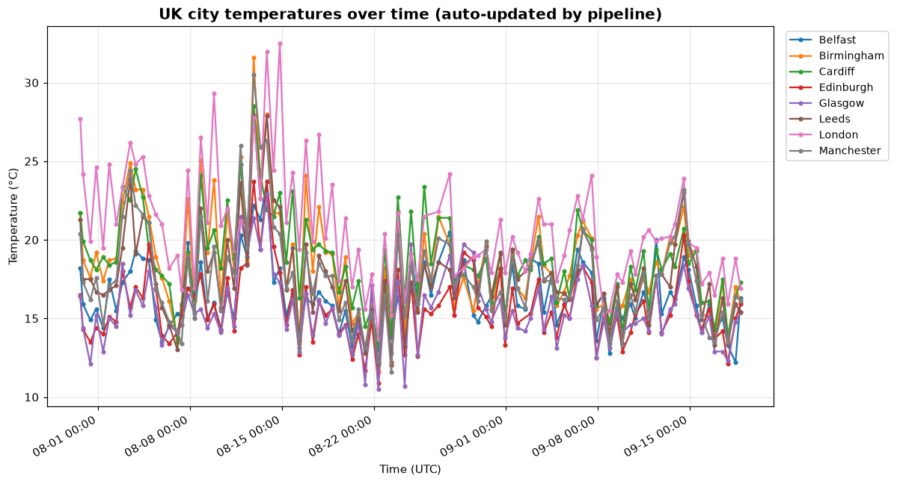

# UK Weather Data Pipeline

An **automated data pipeline** that collects live weather data for eight UK
cities twice a day, appends it to a growing historical dataset, and
regenerates summary tables and a trend chart — all running on a schedule with
**GitHub Actions**, with no server and no manual steps.

Every scheduled run commits fresh data back to this repo, so the dataset and
chart below update themselves over time. The commit history *is* the proof the
pipeline is alive.

## What this demonstrates

Unlike a one-off analysis notebook, this project shows the skills behind a
real, repeatable **data engineering workflow**:

- Pulling data from a live external **API** on a schedule
- **Cleaning and structuring** semi-raw JSON into a tidy tabular format
- **Incrementally appending** to a growing historical store (not overwriting)
- **Automating** the whole thing with GitHub Actions (cron-scheduled CI/CD)
- Producing **auto-refreshing outputs** (summary CSVs + a chart) with no human
  in the loop

## Live output

> On a fresh clone the chart and data files below are empty — they are
> generated by the pipeline. The first run happens automatically on the
> initial push to `main` (and twice daily thereafter), after which this
> section populates with real data.

The chart below is regenerated on every pipeline run:



Running summary tables:
- [`data/latest_snapshot.csv`](data/latest_snapshot.csv) — most recent reading per city
- [`data/city_averages.csv`](data/city_averages.csv) — running averages, min/max per city
- [`data/weather_history.csv`](data/weather_history.csv) — the full growing time series

## How it works

```
                  ┌─────────────────────────────────────────┐
   GitHub Actions │  cron schedule (07:00 & 19:00 UTC daily) │
     (no server)  └───────────────────┬─────────────────────┘
                                       │ triggers
                                       ▼
              ┌────────────────────────────────────────────┐
              │  1. fetch_weather.py                        │
              │     → calls Open-Meteo API for 8 UK cities  │
              │     → parses JSON, decodes weather codes    │
              │     → APPENDS rows to weather_history.csv    │
              └───────────────────┬────────────────────────┘
                                  ▼
              ┌────────────────────────────────────────────┐
              │  2. analyse_weather.py                      │
              │     → reads full history                    │
              │     → writes latest_snapshot + averages     │
              │     → regenerates temperature_trend.png      │
              └───────────────────┬────────────────────────┘
                                  ▼
              ┌────────────────────────────────────────────┐
              │  3. Git commit + push (by the Action)       │
              │     → updated data & chart committed to repo │
              └────────────────────────────────────────────┘
```

## Data source

[Open-Meteo](https://open-meteo.com) — a free, open weather API that requires
**no API key and no signup** (CC BY 4.0 licensed data). This makes the pipeline
fully self-contained: there are no secrets to configure and nothing that can
expire, so scheduled runs keep working indefinitely.

Cities tracked: London, Birmingham, Manchester, Glasgow, Cardiff, Belfast,
Edinburgh, Leeds. Variables captured per reading: temperature, apparent
temperature, humidity, wind speed, precipitation, and a decoded weather
description.

## Project structure

```
uk-weather-pipeline/
├── .github/workflows/
│   └── weather-pipeline.yml   # the scheduled automation
├── scripts/
│   ├── fetch_weather.py       # collect + append (step 1)
│   └── analyse_weather.py     # summarise + chart (step 2)
├── data/                      # pipeline output — committed, grows over time
│   ├── weather_history.csv
│   ├── latest_snapshot.csv
│   └── city_averages.csv
├── assets/
│   └── temperature_trend.png  # auto-generated chart
└── requirements.txt
```

## Running it manually

You can run the pipeline locally, or trigger it on demand from the
**Actions** tab on GitHub (the "Run workflow" button).

Locally:

```bash
pip install -r requirements.txt
python scripts/fetch_weather.py      # fetch + append one snapshot
python scripts/analyse_weather.py    # regenerate summaries + chart
```

## Design notes

- **Resilient to partial failure** — if one city's request fails, the run logs
  it and continues with the others rather than aborting the whole pipeline.
- **Idempotent header handling** — the history CSV's header is written once;
  subsequent runs append data rows only.
- **First-run safe** — the chart logic handles the case where only a single
  snapshot exists (it plots points instead of lines until there's a trend to
  draw).
- **No secrets** — because Open-Meteo needs no key, the workflow needs no
  configured secrets, which keeps it simple and secure.

## Possible extensions

- Add a rolling 7-day / 30-day average alongside the all-time average.
- Publish the chart and tables to a GitHub Pages dashboard.
- Add simple anomaly flagging (e.g. temperature far outside a city's norm).
- Expand to more cities or additional weather variables.

## Tech stack

Python (requests, pandas, matplotlib), GitHub Actions (scheduled CI/CD),
Open-Meteo API.
